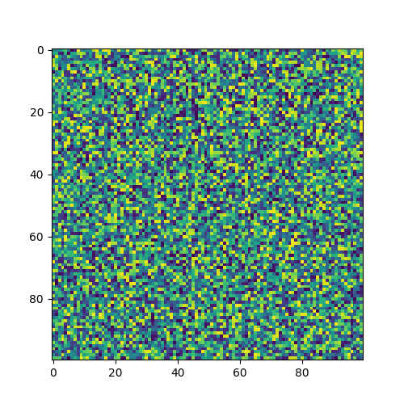

# Usage

Import quicklook in python and view a numpy array

    from quicklook import quicklook

    quicklook.show(arr)

## Numpy array example

The example array above was generated using `static()`

    arr = quicklook.static()

## Numpy array from file

You might want to load an image from file into a numpy array 

    arr = quicklook.load('path/to/image.png')

